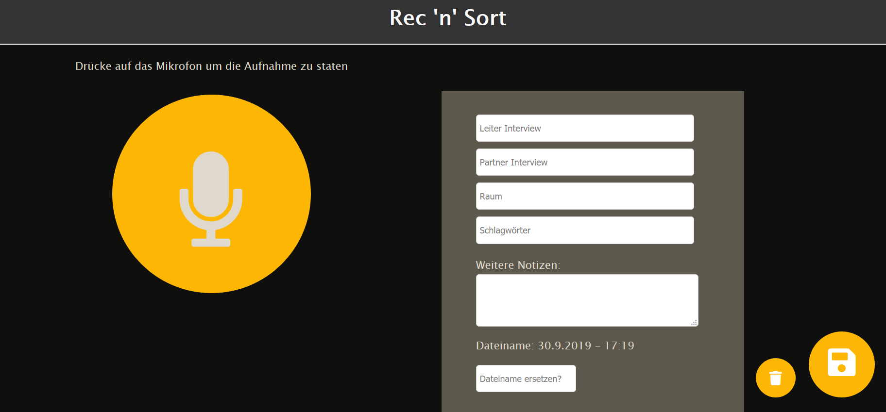

# Projekt

Bei studentischen Projekten fallen immer wieder Evaluationen und Nutzerbefragungen an. Um diese Befragungen einfach aufnehmen zu können, haben wir Rec 'n' Sort entwickelt. Mit der Anwendung kann der Nutzer am PC Tonaufnahmen dieser Befragungen machen und diesen weitere Meta-Daten für die einfache Sortierung und Übersichtlichkeit mitgeben. Die fertige Aufnahme inklusive Meta-Daten kann dann gespeichert werden.

Zu erreichen ist die Anwendung unter: 

[Beschreiben Sie hier in einer kurzen Zusammenfassung Hintergrund, Ziele und Funktionen Ihrer Anwendung. Fügen Sie einen sinnvollen Screenshot ein. Geben Sie eine Link zu einer lauffähigen, online-erreichbaren Version der fertigen Anwendung an.]

## Team

| | Infos | Implementierte Komponenten
|-|-|-|
 | **Burak Sahan** E-Mail: buraksahan@gmx.de Github-Nutzer: buraks95 | Burak Sahan hat die Komponente zum Download der Aufnahmen implementiert, sowie sich um die richtige Speicherung der Daten gekümmert. |
 | **Christina Sedlmeier** E-Mail: Sedlmeier.christina@gmail.com Github-Nutzer: ChristinaSedlmeier | Christina Sedlmeier hat den Recorder zur Aufzeichnung der Befragungen implementiert, sowie das HTML- und CSS-Grundgerüst entwickelt. |
 | **Rafael Waldmüller** E-Mail: waldmueller.r@gmail.com Github-Nutzer: RafaelWaldmueller | Rafael Waldmüller hat den Player zum Abspielen der Aufnahmen implementiert, sowie sich um eine bessere Strukturierung der Module gekümmert. |

## Setup

Im Starterpaket ist ein einfacher Webserver vorgegeben, mit dem Sie die Inhalte des Ordners `/app` statisch ausliefern können. Benutzen Sie diesen, um Ihre Anwendung zu entwickeln und zu testen. Sollten Sie zu Realisierung Ihrer Anwendung eine komplexere Serverkomponente benötigen, können Sie die vorhandenen Dateien (`index.js` und `lib/AppServer.js`) als Ausgangslage für eigene Erweiterungen nutzten. Speichern Sie alle weiteren, serverseitig verwendeten Dateien im Verzeichnis `/lib` ab.

So nutzen Sie den vorgegebenen Server:

1. Führen Sie **einmalig** den Befehl `npm install` aus, um die notwendigen Abhängigkeiten (`express`) zu installieren.

2. Führen Sie den Befehl `npm start` aus um die Anwendung zu starten. Der Inhalt des `/app`-Verzeichnis ist anschließend über die die Adresse `http://localhost:8000/app` erreichbar.

[Beschreiben Sie alle Schritte, die notwendig sind um Ihre Anwendung auf Basis dieses Repositories zu starten.]

## Beschreibung

Rec 'n' Sort ist eine Webanwendung für Studierende. Über ein Interface können Nutzerbefragungen und Evaluationen aufgenommen und anschließend gespeichert werden. Zuvor kann der Nutzer den Leiter und Partner des Interviews, Raum, Schlagwörter und weitere Notizen hinzufügen. Nach der Aufnahme kann der Nutzer durch einen Player die Aufnahme nochmal anhören und bei wichtigen Vorkommnissen mit einem Time-Stamp Anmerkungen  hinzufügen. Das Datum wird automatisch hinzugefügt. Der Nutzer kann die Aufnahme speichern, er bekommt in einer ZIP-Datei die Aufnahme als MP3-Datei und eine Textdatei mit allen Annotationen und Meta-Daten die eingefügt worden sind. 

### Features

Eine Übersicht aller ursprünglich geplanten und dokumentierten Features finden Sie [hier](Features.md).

- Aufnahme: Beim Start muss der Nutzer der Anwendung Zugriff aufs Mikrofon erlauben. Der Nutzer kann dann auf das Aufnahme-Symbol klicken, um eine Aufnahme zu starten. Er kann die Aufnahme pausieren, oder ganz stoppen. Falls ihm die Aufnahme nicht gefallen hat, kann er sie einfach durch Klicken auf den Mülleimer löschen.

- Meta-Daten: Der Nutzer kann wichtige Meta-Daten zur Aufnahme angeben (Leiter, Partner, Raum, Schlagwörter). Das Notizenfeld kann verwendet werden, um Beobachtungen während der Aufnahme aufzuschreiben.

- Annotationen: Der Nutzer kann nach der Aufnahme über einen Player die Aufnahme nochmal anhören. Hier kann er eine Zeit auswählen, und zu diesem Zeitpunkt eine Annotation schreiben, wenn beispielsweise etwas Wichtiges vorgefallen ist.

- Speichern: Der Nutzer kann die Aufnahme samt Annotationen und Meta-Daten herunterladen. Er lädt hier eine ZIP-Datei herunter, die aus einer MP3-Datei (Aufnahme) und einer Textdatei (Annotationen und Meta-Daten). Der Ordner hat automatisch das aktuelle Datum und Uhrzeit als Namen. Dieser Name kann auch Wunsch aber auch durch das Interface geändert werden.

